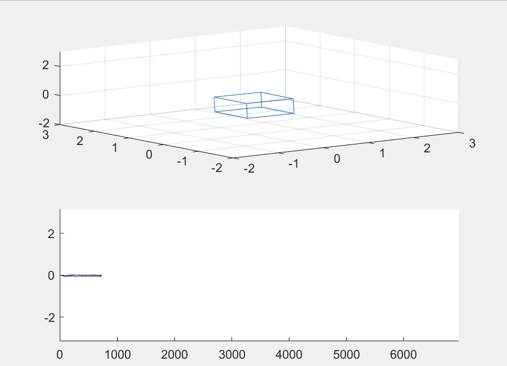

# Development
## Planning
Our first step was to break down the project into discrete deliverabes. We hopped to plan the project such that each week would drive us closer to the finished product, in a timely manner. We broke down the overall project into smaller tasks and dstributed them across the 5 weeks. The Gant Chart below illustrates our inital plan.

However, after week one, it became clear that we could finish this project in one hearty sprint--so we did. After two days of little sleep and non-stop work, we accomplished all three challenges of the assignment. A for effort in planning, not so good at staying on schedule.

## Platform Modification
### Communication
The robot, as initially given to us, came pre-configured for manual control from a base station GUI. The robot creates a Wi-Fi hotspot that the base station computer connects to. The GUI sends command packets over TCP to the robot to execute them. Unfortunately, the system came with little support and no usable API. Thus, our first step was to strip away all abstraction from the system.

The onboard Linux computer responsible for creating the access point was removed, and communication was accomplished with an XBee module, connected directly to the rover's Arduino. The Arduino's code was replaced with a simple program that reads bytes from the XBee and interprets them to directly control the motors through the motor shield. The base computer communicates with its XBee module over serial, meaning a variety of languages could be used for the main control algorithms. Initially, we planned on using Matlab, but ultimately used Python.

The new system is low-level when compared to the original one, giving more control of functionality and timing. Using the new approach, we also understand the code end-to-end and no longer have to deal with 'black boxes' when debugging.

### Hardware
The rover was originally build with 4 wheels and controlled like a tread vehicle. The overall system was inconsistent during turns, affected by slipping due to the nature of this type of turning mechanism as well poor friction between the wheels and the slippery floor.

In order to improve physical control of the vehicle, the two front wheels were removed and replaced with a single wheel on a caster. The back wheels were replaced with higher friction wheels. This system resulted in almost no slippage. Additionally, a mast was added to mount the IMU+Mag. Using LEGO Technic pieces, the sensor system was mounter 30 cm above the vehicle platform in order to limit motor EM waves from interfering with the Magnetometer.

# INSERT PICTURES

### Attitude Heading Reference Systems (AHRS)
In order to control rover, we wanted to use an on-board IMU+Magnetonometer to create an AHRS to assist in navigation. We believed that this, alongside the machine vision tracking system to yield the best results. We hoped to combine the data using a Kalman Filter.

 AHRS algorithms are extremely complex. In order to speed up development, a [library](http://x-io.co.uk/open-source-imu-and-ahrs-algorithms/) by Sebastian Madgwick was used. The Matlab implementation offered the quickest path to testing. In order to assist visualization, GUI was written in matlab to show orientation in space based on the AHRS calculations. The GIF below shows how the GUI works, using test data provided by Madgwick:

Initially, the GY-85 sensor was used. This board is 9 degree of freedom IMU, with Magnetometers on-board. However, the acceleration values were not right, not providing an accurate gravity vector when in standstill. After little success with this sensor, we switched to the [Grove - IMU 10DOF](http://wiki.seeedstudio.com/Grove-IMU_10DOF/). This sensor, with accessible example code allowed us to quickly test AHRS with real data. Unfortunately, the overall system was too sensitive to nearby metal objects and interference from the DC motors. After several hours, the painful decision was made to abandon IMU approach.

### Machine Vision Tracking System
In order to get the position of the rover and its target, a machine vision software was used. Initially, the setup and software was to be provided, but we needed access to the setup before it was ready. As a result, we turned to a software previously used: reacTIVsion. This software identifies and tracks fiducial markers, reporting both their xy position (normalized) as well as their orientation. In our setup, we were limited by the over head camera frame-rate at 30 FPS. The machine vision software dumps its data on a TUIO port, where we could read it using pytuio, a Python library.

Solarized dark                       |  Solarized Ocean
:-----------------------------------:|:-------------------------:
  |  
